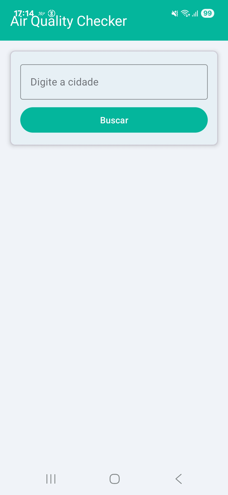
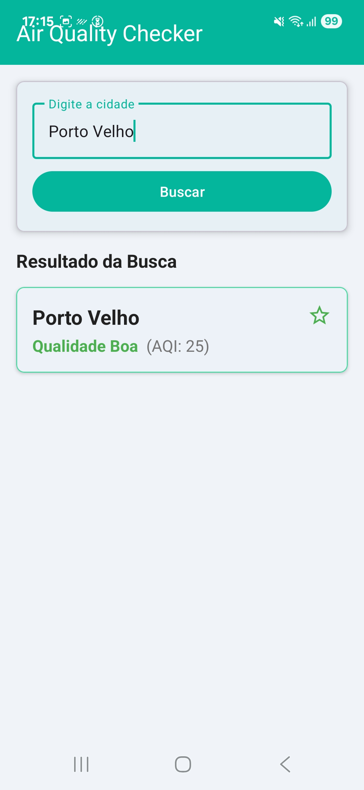
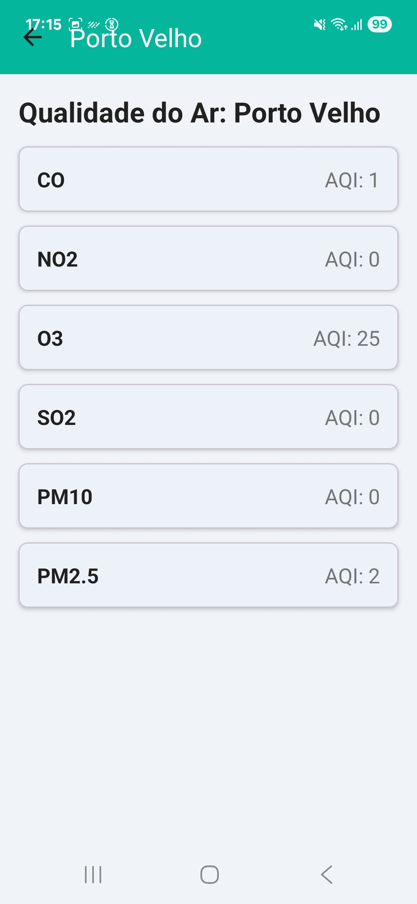

Projeto Individual: Air Quality Checker - Atividade 02 de PDM

Um aplicativo Android simples que busca e exibe informações de qualidade do ar, desenvolvido como um projeto para a disciplina de Programação para Dispositivos Móveis.

O projeto foi criado com fins educacionais para demonstrar o consumo de APIs REST, manipulação de dados JSON, persistência de dados locais e a construção de uma interface de usuário dinâmica com componentes modernos do Android.

🚀 Funcionalidades

Busca por Cidade: Permite que o usuário digite o nome de uma cidade para obter os dados de qualidade do ar.

Resumo de Qualidade: Exibe um resumo do status da qualidade do ar (Bom, Mediano, Ruim) e o índice AQI (Air Quality Index) geral na tela principal.

Detalhes de Poluentes: Ao clicar no resultado, o app abre uma tela de detalhes com a lista de poluentes individuais (CO, NO2, PM2.5, etc.).

Lista de Favoritos: Permite ao usuário salvar suas cidades favoritas, que são salvas no dispositivo.

Persistência de Dados: Utiliza SharedPreferences para salvar a lista de favoritos, que é recarregada assim que o app é aberto.

💻 Tecnologias e Conceitos Utilizados

Linguagem: Java

IDE: Android Studio

Framework: Android SDK

Bibliotecas Principais:

Retrofit: Para fazer as chamadas HTTP à API de qualidade do ar de forma eficiente.

GSON: Para converter a resposta da API (JSON) em objetos Java.

SharedPreferences: Para persistir a lista de cidades favoritas localmente no dispositivo.

Componentes de UI:

ViewBinding: Para acessar os componentes de layout de forma segura, eliminando findViewById.

RecyclerView: Para exibir a lista de resultado da busca e a lista de favoritos.

MaterialCardView: Para criar os cards de exibição dos resultados.

TextInputEditText / TextInputLayout: Para a entrada de texto da cidade.

ImageButton: Para os botões de favoritar e deletar.

TextView: Para exibir todas as informações de texto.

ProgressBar: Para indicar o carregamento dos dados.

📱 Demonstração do Fluxo

Ao abrir o app, a tela principal exibe a barra de busca e a lista de cidades favoritas (se houver).

O usuário digita o nome de uma cidade (ex: "São Paulo") e clica em "Buscar".

A aplicação faz uma chamada à API (API-Ninjas) com a cidade pesquisada.

A tela exibe um card de resultado com o status resumido (ex: "Qualidade Mediana").

O usuário pode clicar na estrela para salvar a cidade na lista de favoritos (usando SharedPreferences).

Ao clicar sobre o card de resultado, uma nova tela (DetailsActivity) é aberta usando uma Intent.

A tela de detalhes exibe a lista completa de poluentes (CO, NO2, etc.) para aquela cidade, dados que foram passados pela Intent.

O usuário também pode clicar em um item da lista de favoritos para pesquisá-lo novamente ou excluí-lo.

📷 Screenshots

📡 API Utilizada

Este projeto utiliza a API gratuita API-Ninjas Air Quality para obter os dados de qualidade do ar. É necessário um cadastro para obter uma chave de acesso (API Key) para que as chamadas funcionem.

🎯 Objetivos de Aprendizagem

Entender o ciclo de uma requisição de rede em um app Android.

Aprender a consumir dados de uma API com a biblioteca Retrofit.

Realizar o parsing de dados no formato JSON (com GSON).

Implementar múltiplas listas dinâmicas e eficientes usando RecyclerView.

Gerenciar a navegação entre telas (Activities) usando Intents para passar dados (incluindo objetos Serializable).

Persistir dados simples do usuário (favoritos) usando SharedPreferences.

Organizar o projeto em pacotes (activities, models, services, utils) para separação de responsabilidades.

📝 Licença

Este projeto foi desenvolvido para fins didáticos e pode ser usado livremente como material de estudo e portfólio acadêmico.